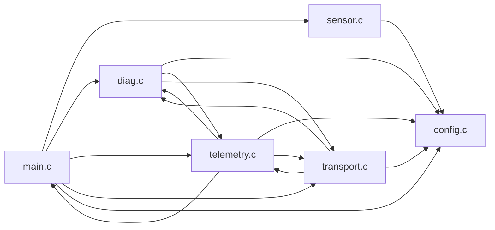

# Sensor-monitor firmware fixtures

These fixtures model a small, freestanding sensor monitor. `Reset_Handler` enters `main`, which initializes the application and runs a cooperative loop. Every four ticks it samples a simulated ADC, updates a moving-average filter and sample history, and checks diagnostics. Every eight ticks it creates a telemetry packet with a sequence number, calibrated value, fault flags, and checksum. A bounded transmit queue verifies packets and records a simulated UART write.

The input is a deterministic pseudo-random ADC signal. The output is an observable volatile checksum register. The fixtures contain no vendor code and are analysis inputs rather than board-bootable images: real startup code would also initialize RAM and configure hardware/timers.

| Source | Responsibility |
|---|---|
| [main.c](src/main.c) | Initialization, scheduling, sample history, main loop, RAM calibration, board callback |
| [config.c](src/config.c) | Sampling/reporting periods, baud rates, alarm profiles, checksum seed |
| [sensor.c](src/sensor.c) | Seeded ADC simulator, four-sample moving-average filter |
| [diag.c](src/diag.c) | Range/backpressure checks, persistent fault count, latched fault flags |
| [telemetry.c](src/telemetry.c) | Calibration, packet construction, checksum calculation |
| [transport.c](src/transport.c) | Four-packet ring queue, checksum validation, simulated transmission |
| [app.h](src/app.h) | Shared structures, fault flags, module interfaces |
| [cortex-m.ld](src/cortex-m.ld) | Flash/RAM layout, copied RAM code, initialized data, BSS, reservation |

The **Dependencies** tab shows six source units and sixteen directed connections. Arrows below point toward the dependency; reciprocal unit connections do not imply recursive function calls. For example, diagnostics uses the pure telemetry calibration helper, while packet creation invokes diagnostics. Queue inspection and fault recording are leaf operations.



Open `fixtures/build/cortex-m.elf` from the build folder to explore the graph. Rescan or press F5 after rebuilding. The stripped variant retains object dependencies with unknown source ownership and sizes.

## Formatting and regeneration

The C files use four-space indentation, braces on separate lines for functions, and an 88-column limit. [`.clang-format`](.clang-format) records the style:

```sh
clang-format -i fixtures/src/*.c fixtures/src/*.h
clang-format --dry-run --Werror fixtures/src/*.c fixtures/src/*.h
```

The committed ELF files were generated with xPack GNU Arm GCC 14.2.1-1.1 for Cortex-M3, Thumb, `-O0 -g -gdwarf-4 -fstack-usage`. Warnings are enabled and treated as errors. Run from the repository root:

```sh
python fixtures/generate.py --gcc arm-none-eabi-gcc
```

Alternatively, Clang with ARM target support and `ld.lld` can regenerate the images:

```sh
python fixtures/generate.py
```

The generator configures an actual out-of-source CMake/Ninja build using [CMakeLists.txt](CMakeLists.txt) and the [ARM toolchain file](cmake/arm-none-eabi.cmake). Regeneration requires CMake 3.20 or newer, Ninja, and the selected compiler. The committed artifact snapshot has the same target layout that CMake generates:

```text
fixtures/
├── CMakeLists.txt
├── cmake/arm-none-eabi.cmake
├── src/                         # C sources, headers, linker script
└── build/
    ├── compile_commands.json
    ├── cortex-m.elf
    ├── cortex-m.map
    ├── cortex-m-grown.elf
    ├── cortex-m-grown.map
    ├── cortex-m-stripped.elf
    ├── cortex-m-stripped.map
    └── CMakeFiles/
        ├── cortex-m-objects.dir/src/
        │   ├── main.c.obj
        │   ├── main.c.su
        │   └── ...              # Six object files and six stack reports
        └── cortex-m-grown-objects.dir/src/
            ├── main.c.obj
            ├── main.c.su
            └── ...              # The grown configuration's objects/reports
```

Baseline and stripped images share the baseline objects. Each configuration's stack reports cover 24 functions. To inspect only the baseline reports, use:

```sh
cargo run -p snout-cli -- stack fixtures/build/cortex-m.elf \
    --stack-usage fixtures/build/CMakeFiles/cortex-m-objects.dir/src
```

Scanning the whole build folder also discovers the grown configuration's reports. CMake's machine-specific cache, compiler probes, Ninja rules, and build bookkeeping are recreated locally and ignored by Git; ELF, map, object, stack-report, and compilation-database artifacts are committed. Tests use these artifacts and need no ARM toolchain. Debug paths and compilation-database commands reflect the generation machine.

GNU ld maps include the 256 KiB Flash / 64 KiB RAM capacities and raw-symbol cross references (`--cref --no-demangle`). LLVM lld ELF maps support section-placement previews and cross-reference imports, but do not provide physical memory capacities. Toolchains may produce different code sizes; test totals refer to the stated GCC version.

## Memory layout

GNU `arm-none-eabi-size -A` / `arm-none-eabi-readelf -l -S` reference for the baseline:

| Section | Bytes | Flash | RAM |
|---|---:|---:|---:|
| `.text` | 1344 | 1344 | 0 |
| `.rodata` | 80 | 80 | 0 |
| `.unusual_constants` | 8 | 8 | 0 |
| `.ram_code` | 28 | 28 | 28 |
| `.data` | 24 | 24 | 24 |
| `.bss` | 176 | 0 | 176 |
| `.reserved` | 128 | 0 | 128 |
| **Total** | | **1484** | **356** |

`cortex-m-grown.elf` reserves eight additional 32-bit sample slots. Flash stays 1484 bytes; RAM grows by 32 to 388 bytes. Scheduling uses the fixed sixteen-slot window so the comparison isolates storage growth. `cortex-m-stripped.elf` has the baseline layout without symbols or debug information. A weak callback alias and a deliberately mangled function remain explicit analyzer test cases. Shared alias storage must not be counted twice.


## LLVM lld map fixture

`maps/llvm-lld.elf` and `maps/llvm-lld.map` were linked with lld 21.0.0 from the committed Cortex-M objects. They exercise actual lld section placement, distinct load/runtime addresses, DWARF precedence, and cross references. Tests use the committed outputs and do not require an LLVM installation. Regenerate from the repository root (quote the map option in PowerShell):

```sh
ld.lld -T fixtures/src/cortex-m.ld --cref --no-demangle "-Map=fixtures/maps/llvm-lld.map" -o fixtures/maps/llvm-lld.elf fixtures/build/CMakeFiles/cortex-m-objects.dir/src/main.c.obj fixtures/build/CMakeFiles/cortex-m-objects.dir/src/config.c.obj fixtures/build/CMakeFiles/cortex-m-objects.dir/src/sensor.c.obj fixtures/build/CMakeFiles/cortex-m-objects.dir/src/diag.c.obj fixtures/build/CMakeFiles/cortex-m-objects.dir/src/telemetry.c.obj fixtures/build/CMakeFiles/cortex-m-objects.dir/src/transport.c.obj
```
