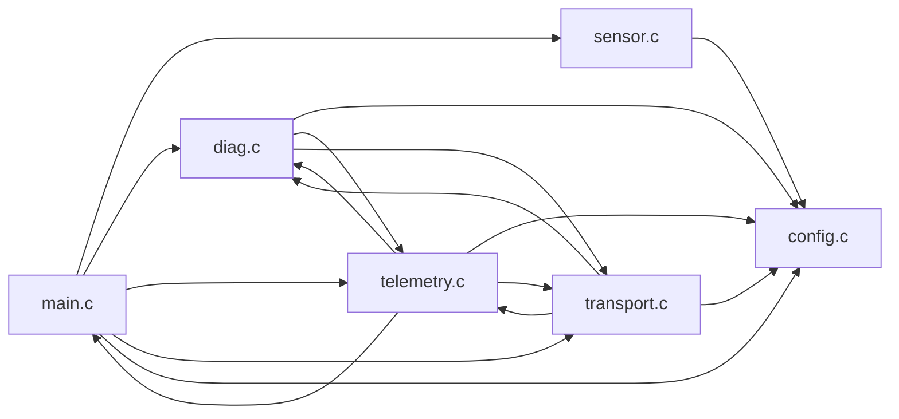

# Sensor-monitor firmware fixtures

These fixtures model a small, freestanding sensor monitor. `Reset_Handler` enters `main`, which initializes the application and runs a cooperative loop. Every four ticks it samples a simulated ADC, updates a moving-average filter and sample history, and checks diagnostics. Every eight ticks it creates a telemetry packet with a sequence number, calibrated value, fault flags, and checksum. A bounded transmit queue verifies packets and records a simulated UART write.

The input is a deterministic pseudo-random ADC signal. The output is an observable volatile checksum register. The fixtures contain no vendor code and are analysis inputs rather than board-bootable images: real startup code would also initialize RAM and configure hardware/timers.

| Source | Responsibility |
|---|---|
| [main.c](src/main.c) | Initialization, scheduling, sample history, main loop, RAM calibration, board callback |
| [config.c](src/config.c) | Sampling/reporting periods, baud rates, alarm profiles, checksum seed |
| [sensor.c](src/sensor.c) | Seeded ADC simulator, four-sample moving-average filter |
| [diag.c](src/diag.c) | Range/backpressure checks, persistent fault count, latched fault flags |
| [telemetry.c](src/telemetry.c) | Calibration, packet construction, checksum calculation |
| [transport.c](src/transport.c) | Four-packet ring queue, checksum validation, simulated transmission |
| [app.h](src/app.h) | Shared structures, fault flags, module interfaces |
| [cortex-m.ld](src/cortex-m.ld) | GNU/LLVM Flash/RAM layout, copied RAM code, initialized data, BSS, reservation |
| [cortex-m-ti.cmd](src/cortex-m-ti.cmd) | TI linker layout with separate load and run addresses |
| [custom_sections.c](src/custom_sections.c) | Additional LLVM/TI RAM code in `.sensor_calibration_code` |

The GCC fixture's **Dependencies** tab shows six source units and sixteen directed connections. Arrows below point toward the dependency; reciprocal unit connections do not imply recursive function calls. For example, diagnostics uses the pure telemetry calibration helper, while packet creation invokes diagnostics. Queue inspection and fault recording are leaf operations.



Open `fixtures/build/gcc/cortex-m.elf` to explore the reference firmware. Each compiler folder contains baseline, grown and stripped variants. Rescan or press F5 after rebuilding.

## Compiler environment

[Dockerfile](Dockerfile) installs these **Cortex-M3/Thumb** toolchains:

| Folder | Compiler/linker | Map information |
|---|---|---|
| `gcc` | Arm GNU Toolchain 14.2.rel1 (GCC 14.2.1 / GNU ld) | Capacities, placements and cross references |
| `llvm` | Ubuntu Clang/lld 21 | Placements and cross references; no physical capacities |
| `ti-cgt` | Classic TI Arm CGT 20.2.7.LTS (`armcl`) | Capacities and separate load/run placements |
| `ti-clang` | TI Arm Clang 4.0.3.LTS (`tiarmclang` / TI linker) | Capacities and separate load/run placements |

GCC and TI downloads use fixed versions and SHA-256 verification against vendor checksums. LLVM 21 comes from Ubuntu 26.04 packages, whose patch versions may change with package updates. TI installers retain their bundled license/manifest files: [TI Arm CGT](https://www.ti.com/tool/download/ARM-CGT/20.2.7.LTS), [TI Arm Clang](https://www.ti.com/tool/download/ARM-CGT-CLANG/4.0.3.LTS). Compilers are installed inside the image and are not committed to this repository.

Build and regenerate from the fixture directory:

```sh
cd fixtures
docker build --platform linux/amd64 -t snout-fixtures .
mkdir -p build
docker run --rm --platform linux/amd64 \
    --user "$(id -u):$(id -g)" \
    -v "$PWD/build:/output" snout-fixtures
```

The image smoke-builds all four compilers during construction and includes the fixture sources; rebuild it after changing sources. Classic TI CGT requires an x86_64 Linux host environment, so Arm hosts need Docker's `linux/amd64` emulation. Omit `--user` on hosts without `id` and manage generated-file ownership as appropriate for that host.

The container builds in a temporary directory and exports only `.elf`, `.map` and `.su` artifacts into `/output/<toolchain>`. The bind mount places them in `fixtures/build/<toolchain>`. Temporary CMake caches, object files, compilation databases and Ninja bookkeeping are removed. Each selected compiler subfolder is replaced after that compiler builds successfully, removing stale artifacts. Other compiler subfolders are left intact. The root `.gitignore` independently allows only ELF, map and stack-report files under `fixtures/build`. The Docker context is only `fixtures/`; its `.dockerignore` excludes build output and local caches.

```text
fixtures/build/
├── gcc/
│   ├── cortex-m.elf
│   ├── cortex-m.map
│   ├── cortex-m-grown.elf
│   ├── cortex-m-grown.map
│   ├── cortex-m-stripped.elf
│   ├── cortex-m-stripped.map
│   └── CMakeFiles/
│       ├── cortex-m-objects.dir/src/*.su
│       └── cortex-m-grown-objects.dir/src/*.su
├── llvm/       # Same image variants, maps and Clang stack reports
├── ti-cgt/     # Same image variants and TI maps
└── ti-clang/   # Same image variants and TI maps
```

Generate just one compiler from the same `fixtures/` directory by overriding the image's default arguments:

```sh
docker run --rm --platform linux/amd64 \
    --user "$(id -u):$(id -g)" \
    -v "$PWD/build:/output" snout-fixtures \
    --toolchain ti-cgt --output-dir /output
```

## Local regeneration and formatting

From the repository root, the same generator supports locally installed compilers. CMake 3.29+, Ninja and the selected compiler are required:

```sh
python3 fixtures/generate.py --toolchain all
python3 fixtures/generate.py --gcc arm-none-eabi-gcc
python3 fixtures/generate.py --toolchain llvm --clang clang
python3 fixtures/generate.py --toolchain ti-cgt --armcl /path/to/armcl
python3 fixtures/generate.py --toolchain ti-clang --tiarmclang /path/to/tiarmclang
```

The default is GCC, exported into `fixtures/build/gcc`. `--output-dir DIR` changes the artifact root, retaining compiler subfolders. `all` checks that every requested compiler is available before starting and fails rather than silently skipping tools. Upstream Clang requires `ld.lld`; TI stripped variants also require GNU `arm-none-eabi-strip` on `PATH`.

The C files use four-space indentation, braces on separate lines for functions, and an 88-column limit, as specified in [`.clang-format`](.clang-format):

```sh
clang-format -i fixtures/src/*.c fixtures/src/*.h
clang-format --dry-run --Werror fixtures/src/*.c fixtures/src/*.h
```

## Artifact semantics and testing

The generated ELF/map/stack files in `fixtures/build` are committed so routine Rust tests require neither Docker nor cross compilers. Earlier loose artifacts and the duplicate `maps/` and `toolchains/` snapshots have been consolidated into these compiler folders.

GCC uses `-O0 -g -gdwarf-4 -fstack-usage` with warnings treated as errors. Its six-source reference layout retains these totals:

| Section | Bytes | Flash | RAM |
|---|---:|---:|---:|
| `.text` | 1344 | 1344 | 0 |
| `.rodata` | 80 | 80 | 0 |
| `.unusual_constants` | 8 | 8 | 0 |
| `.ram_code` | 28 | 28 | 28 |
| `.data` | 24 | 24 | 24 |
| `.bss` | 176 | 0 | 176 |
| `.reserved` | 128 | 0 | 128 |
| **Total** | | **1484** | **356** |

Each grown image adds eight 32-bit sample slots, increasing static RAM by 32 bytes. Baseline and stripped variants share compiled objects; stripping removes symbols and DWARF without changing section usage. Compiler code sizes differ, so matrix tests compare placement/accounting relationships rather than applying GCC totals to every compiler.

LLVM and TI builds include the additional RAM function in `.sensor_calibration_code`. This long custom name exercises real TI continuation rows prefixed with `*`, `RUN ADDR` annotations, and the following `MODULE SUMMARY` boundary. GCC can include it explicitly with `--custom-sections`; that changes its reference totals and source-unit count.

GCC and upstream Clang emit `.su` reports. Clang's record syntax differs from GCC's currently supported stack-report syntax; TI builds do not emit GCC `.su` reports. TI uses DWARF 4 for classic CGT and DWARF 3 for TI Clang. ELF/DWARF remains authoritative for accounting and attribution. TI maps do not currently supply dependency graphs, while GNU and LLVM maps provide symbol cross references. LLVM maps do not establish physical capacities.

For GCC's baseline stack report:

```sh
cargo run -p snout-cli -- stack fixtures/build/gcc/cortex-m.elf \
    --stack-usage fixtures/build/gcc/CMakeFiles/cortex-m-objects.dir/src
```

Debug paths, map timestamps and some compiler output reflect the generation environment. Outputs are not promised to be byte-identical across machines or package updates.
